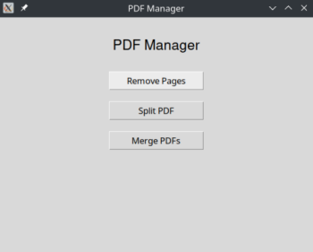

# PDF Manager

PDF Manager is a graphical tool developed in Python with `tkinter` that allows you to perform basic operations on PDF documents, such as removing pages, splitting files, and merging multiple documents into one.




## Features

- **Remove Pages:** Allows you to select a PDF file and remove specific pages.
- **Split PDF:** Splits a PDF file into multiple files based on specified page ranges.
- **Merge PDFs:** Combines two or more PDF files into a single file.

## Prerequisites

- Python 3.8 or higher.
- Required libraries:
  - `tkinter`
  - `PyPDF2`

## Installation

1. Clone this repository.
   ```bash
   git clone git@github.com:CarlosBravoGarran/PDF-Manager.git      # SSH
   cd PDF-Manager
   ```
   ```bash
   git clone https://github.com/CarlosBravoGarran/PDF-Manager.git  # HTTPS
   cd PDF-Manager
   ```
2. Install dependencies (PyPDF2) in your virtual enviroment .
   ```bash
   pip install -r requirements.txt
   ```
3. Install tkinter.

   On Linux:
   ```bash
   sudo apt-get install python3-tk
   ```
   
   On macOS (if not included):
   ```bash
   brew install python-tk
   ```
      

## Usage

Run the main file to open the graphical interface:
```bash
python PDF_Manager.py
```

### Functionalities

#### Remove Pages
1. Click on **Remove Pages**.
2. Select the PDF file.
3. Enter the pages you want to remove (e.g., `1,2,3`).
4. Select the output directory or use the default.
5. Click on **Remove Pages**.

#### Split PDF
1. Click on **Split PDF**.
2. Select the PDF file.
3. Enter the page ranges (e.g., `1-3,4-5` or `1-end`).
4. Select the output directory or use the default.
5. Click on **Split PDF**.

#### Merge PDFs
1. Click on **Merge PDFs**.
2. Select the PDF files.
3. Select the output directory or use the default.
4. Click on **Merge PDFs**.

## Suggestions
To enhance your experience and simplify execution, you can create a shortcut such as an alias in `zsh`:

```bash
alias pdfeditor='pwd | xclip -selection clipboard && cd /home/path/to/directory/PDF-Manager && source venv/bin/activate && python3 PDF_Manager.py && deactivate && cd "$(xclip -selection clipboard -o)"'
```

This alias allows you to quickly navigate to the project directory, activate the virtual environment, run the program, and return to the original directory.


## Contributing

If you think you can improve the project, feel free to contribute. Suggestions, bug reports, and improvements are welcome.
